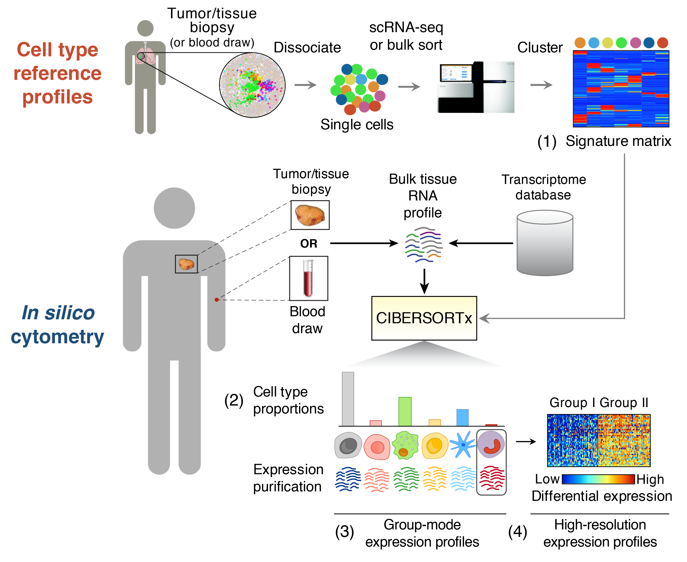

# Introduction

-   肿瘤微环境主要由肿瘤细胞、成纤维细胞、免疫细胞、各种信号分子和细胞外基质及特殊的理化特征等共同组成。

-   肿瘤微环境的免疫环境的复杂性和多样性以及它对免疫治疗以及患者的生存有着十分重要影响。所以解析肿瘤微环境中免疫细胞构成对治疗癌症患者非常有意义。

<!-- -->

-   免疫浸润的本质就是搞清楚肿瘤组织当中免疫细胞的构成比例。

-   **免疫浸润分析方法目前主要有两种：**

    -   对肿瘤组织进行Single cell RNA-seq直接判断。

    -   通过bulk RNA-seq进行推测，检测到整个肿瘤组织的基因表达，就是各种免疫细胞和成纤维细胞、内皮细胞、肿瘤细胞等等混杂在一起的表达，通过一些算法，推断出这个混杂的表达谱中免疫细胞的构成。

# CIBERSORT

{width="655"}

CIBERSORT 是基于线性支持向量回归（linear support vector regression）的原理，对人类免疫细胞亚型的表达矩阵进行去卷积，通过去卷积的方法计算出各个免疫细胞亚群的含量。该方法是基于已知参考集，提供了22种免疫细胞亚型的基因表达特征集：**LM22.txt**

-   CIBERSORT can use in Bulk RNA-seq and Single-seq
-   [CIBERSORT article](https://www.nature.com/articles/s41587-019-0114-2)
-   [CIBERSORT Official Website](https://cibersortx.stanford.edu/index.php) which Provide the ability to run CIBERSORT online, You can only use this Wedsite if you are registered(only use school e-mail to registered).

# CIBERSORT in R script

**以胡艺耀的数据为例子**

## Installing CIBERSORT

```{r}
# library('devtools')
# devtools::install_github("Moonerss/CIBERSORT")
```

## loading package

```{r message=FALSE, warning=FALSE, paged.print=FALSE}
library(knitr)
library(kableExtra)
library(CIBERSORT)
library(dplyr)
library(tibble)
library(tidyr)
library(ggplot2)
library(pheatmap)
```

## per setting

## Matrix data normalization and processing

-   芯片数据

    -   **Affymetrix芯片**使用RMA标准化
    -   **Illumina的Beadchip和Agilent的单色芯片**，用`limma`包的`normalizeBetweenArrays`函数可以用来标准化数据

-   RNA-Seq数据

    -   使用FPKM和TPM都很合适。

-   不能有负值和缺失值

-   不能有重复的基因名，重复基因取平均值或最大值处理

-   不要取log

-   数据格式行名为基因名的Matrix格式

```{r}
# loading express matrix
express_matrix <- read.csv("./FPKM表达.xls.csv")

# 使用 kable 创建表格，并为表格添加样式
kable(head(express_matrix,n=10)) %>%
  kable_styling("striped", full_width = F) %>%  #添加条纹样式并设置表格宽度为自适应
  scroll_box(width = "100%", height = "100%") # 创建一个可滚动的框，设置宽度和高度
```

```{r}
# delete column
express_matrix <- express_matrix[,c(-1,-3)]

# remove "" in genesymbol
express_matrix$Gene.Symbol <- gsub("'", "", express_matrix$Gene.Symbol)


# change as matrix format
row.names(express_matrix)=express_matrix$Gene.Symbol
express_matrix=express_matrix[,c(-1)]
express_matrix=as.matrix(express_matrix)

# remove na row
express_matrix=na.omit(express_matrix)

# 使用 kable 创建表格，并为表格添加样式
kable(head(express_matrix,n=10)) %>%
  kable_styling("striped", full_width = F) %>%  #添加条纹样式并设置表格宽度为自适应
  scroll_box(width = "100%", height = "100%") # 创建一个可滚动的框，设置宽度和高度
```

## **Run** CIBERSORT

### Loading sig_matrix

```{r}
# Read the LM22 file (immune cell characteristic gene file) that comes with the package

sig_matrix <- system.file("extdata", "LM22.txt", package = "CIBERSORT")
```

### Cibersort parameter

```{r}
#?cibersort
```

-   **perm**: is the number of cycles. The more cycles, the more accurate and time-consuming it is. 1000 is recommended for analysis data.

    In CIBERSORT, **perm** are used for significance testing. By performing random **perm**, CIBERSORT can estimate the p-values for each cell type proportion, helping to determine whether the observed proportion of a cell type is statistically significant.

-   **QN**: `QN`specifies whether to use **quantile normalization**.

    -   `QN = TRUE`: Enables quantile normalization. This is usually recommended for **microarray data** to ensure comparable data distributions across samples.

    -   `QN = FALSE`: Disables quantile normalization. This setting is suitable for **RNA-Seq data**, which may already be normalized (e.g., using TPM or FPKM).

```{r}
#run the cibersort
results <- cibersort(sig_matrix,     # cell sig matrix
                     express_matrix, # rna express matrix
                     perm = 1000,    
                     QN = F
                     )
```

```{r}
# view the result
kable(head(results)) %>%
  kable_styling("striped", full_width = F) %>%  #添加条纹样式并设置表格宽度为自适应
  scroll_box(width = "100%", height = "100%") # 创建一个可滚动的框，设置宽度和高度
```

-   **RMSE** measures the average deviation between the **actual gene expression levels** and the **estimated levels** obtained from the linear model.

    -   **lower RMSE** value generally indicates a better fit, meaning the estimated cell type proportions closely match the observed gene expression data.

    -   **high RMSE** values suggest that the model may not accurately represent the data, possibly due to low-quality input data or mismatched reference cell signatures.

```{r}
# write the result
write.csv(results,file = "./Estimation_cell_type-lm22.csv")
```

## Visualization

### Heatmap

```{r}
# prepare the data
heatmap_data <- results[, c(-23,-24,-25)]


# Create the heatmap
pheatmap(heatmap_data,
         scale = "none", 
         cluster_rows = FALSE,
         color = colorRampPalette(c("white", "red"))(50),  # Color gradient from blue to red
         clustering_distance_rows = "euclidean",    # Use Euclidean distance for clustering rows
         cluster_cols = FALSE,    
         clustering_method = "complete",            # Clustering method
         show_rownames = TRUE,                      # Display sample names
         show_colnames = TRUE,                      # Display cell type names
         main = "Cell Type Proportion Heatmap") 
```
