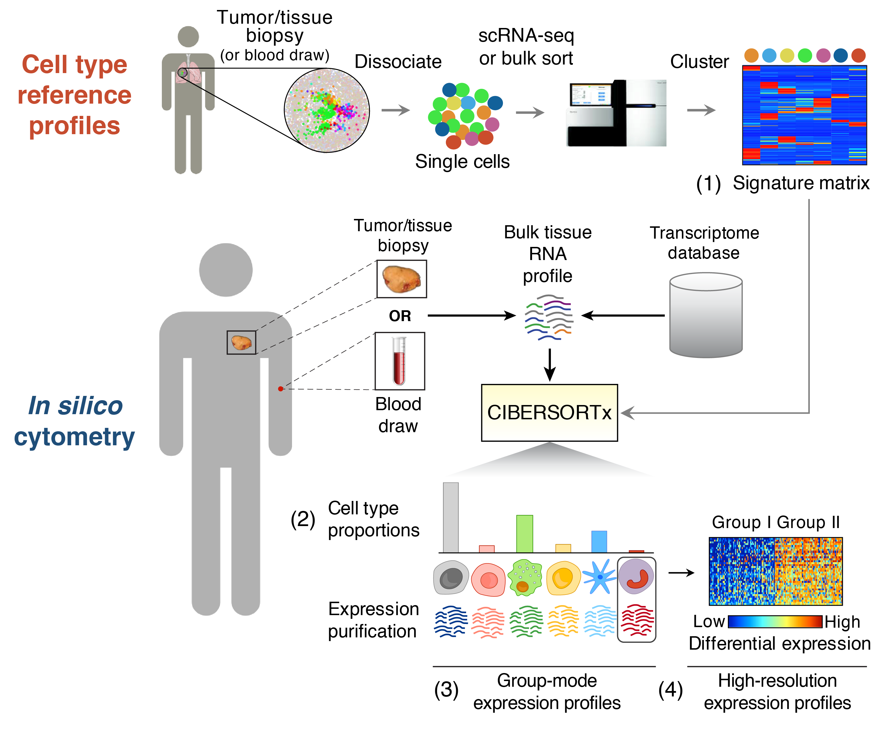

# Immune-infiltration

-   肿瘤微环境主要由肿瘤细胞、成纤维细胞、免疫细胞、各种信号分子和细胞外基质及特殊的理化特征等共同组成。

-   肿瘤微环境的免疫环境的复杂性和多样性以及它对免疫治疗以及患者的生存有着十分重要影响。所以解析肿瘤微环境中免疫细胞构成对治疗癌症患者非常有意义。

<!-- -->

-   免疫浸润的本质就是搞清楚肿瘤组织当中免疫细胞的构成比例。

-   **免疫浸润分析方法目前主要有两种：**

    -   对肿瘤组织进行Single cell RNA-seq直接判断。

    -   通过bulk RNA-seq进行推测，检测到整个肿瘤组织的基因表达，就是各种免疫细胞和成纤维细胞、内皮细胞、肿瘤细胞等等混杂在一起的表达，通过一些算法，推断出这个混杂的表达谱中免疫细胞的构成。

# CIBERSORT

{width="655"}

CIBERSORT 是基于线性支持向量回归（linear support vector regression）的原理，对人类免疫细胞亚型的表达矩阵进行去卷积，通过去卷积的方法计算出各个免疫细胞亚群的含量。该方法是基于已知参考集，提供了22种免疫细胞亚型的基因表达特征集：**LM22.txt**
